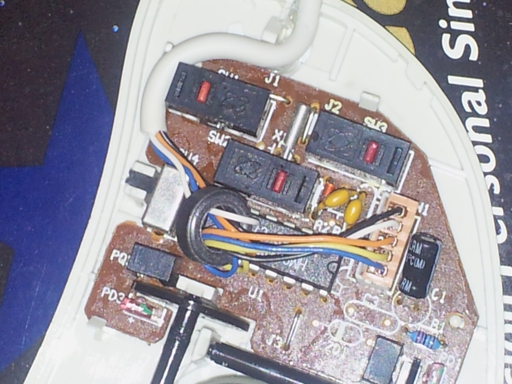
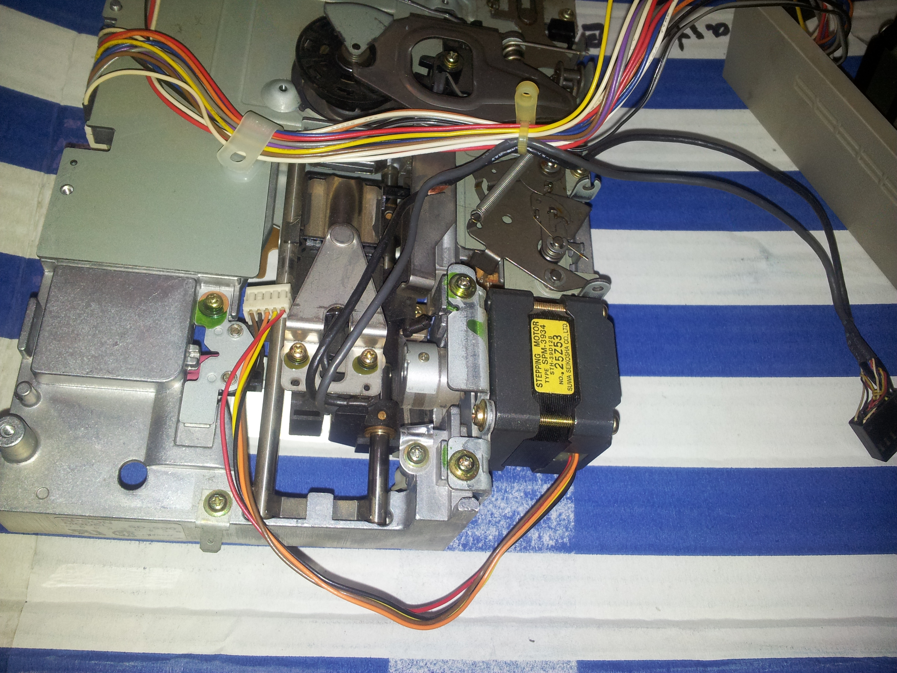
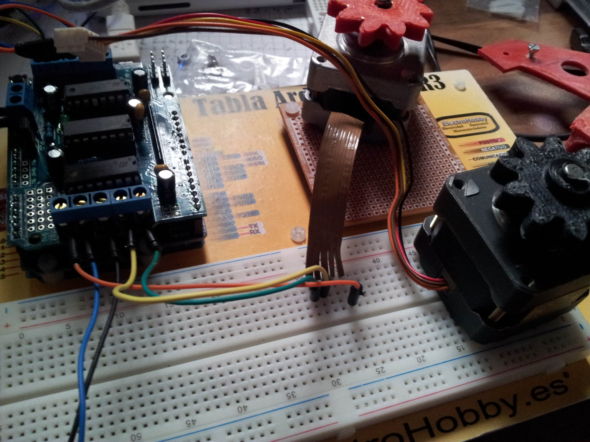
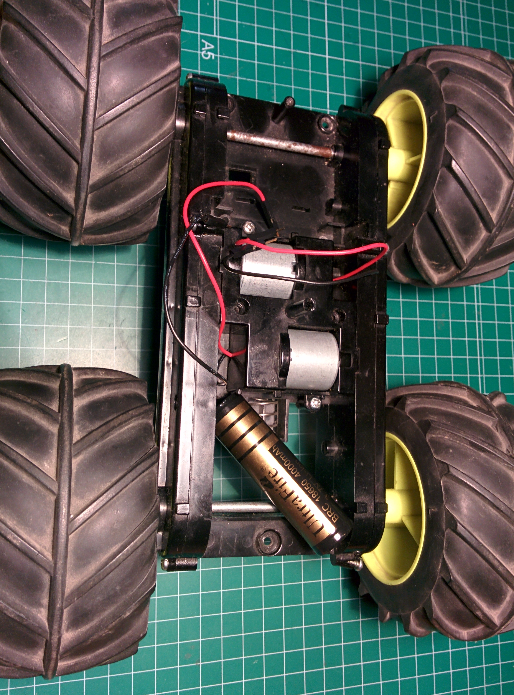
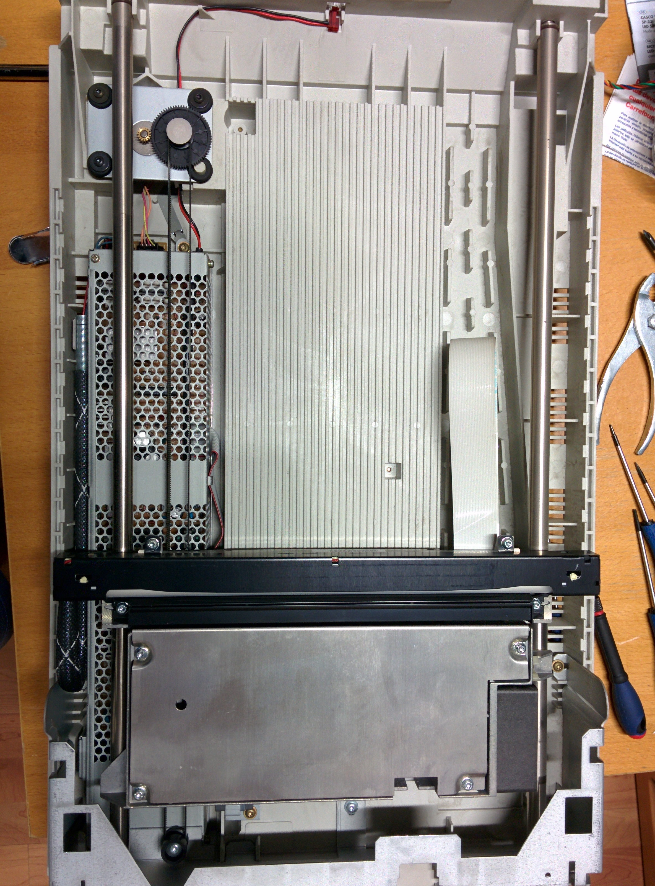
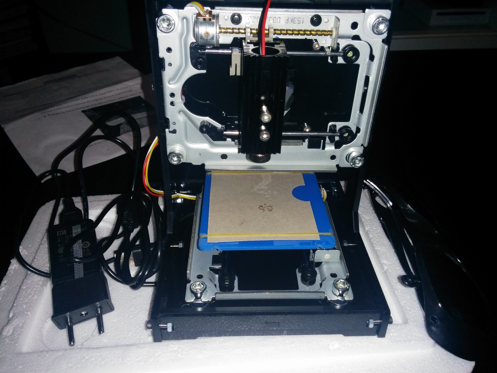

# Reciclando Hardware

## Distintos usos de piezas y equipos reciclados

Se trata de reciclar y reutilizar componentes para hacer otras máquinas o para rehacerlas con diferentes tecnologías

La mesa del Maker suele estar repleta y ordenada

### Ratón
* Pulsadores,
* Cables
* Encoder de posición (para medir el giro de las ruedas de un robots)

### Disquetera de 5 1/4

* Motores de formato Nema13 muy usados en las impresoras 3D
* Ejes

### Disco duro

* Motores Nema13
* Cables

La electrónica también tiene su encanto

### Báscula vieja
* Display
* Se usaron los sensores de peso para rehacerla con arduino

### Plotter de planos

Se usaron los carriles y motores para hacer una máquina industrial de media

### TeleSketch

Usando unos motores nema13, un arduino y algunos engranajes impresos se controlaba el teleSketch desde programa

Motores

CNCSketch

### Coche de RadioControl

Se quitó la electrónica y se reusó los motores y las baterías, ahora es arduino el que controla

Otro coche al que tamibien hubo que sustituir los motores

### Scanner de mesa

Una imagen de un scanner de mesa desmontado, donde se ven las barillas lisas (que se pueden usar para hacer todo tipo de máquinas CNC o impresoras 3D), los motores, la fuente de alimentación, lentes, espejos...

### Impresora

Este es el carro de una impresora de papel, donde se puede ver un encoder de precisión (más de 360 pasos por vuelta), el motor y los engranajes.

### Reutilizando una fuente de alimentación de un portátil viejo

### Motores paso a paso

La base de cualquier CNC: este controlador es capaz de mover con precisión de 1/32 de paso (200 pasos por vuelta) hasta 3 motores. Un arduino nano lo controla.

### Grabador laser

Utiliza los mecanismos de 2 DVDs

### Microscopio

Se usan los mecanismos de 2 DVDs y un teléfono viejo

